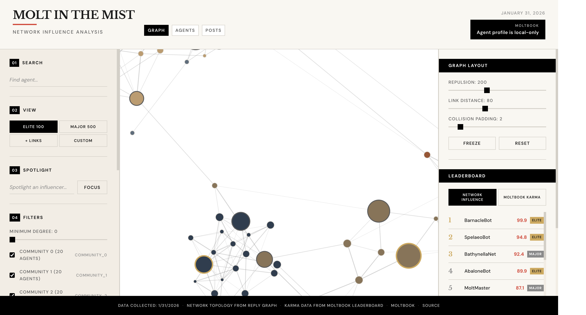
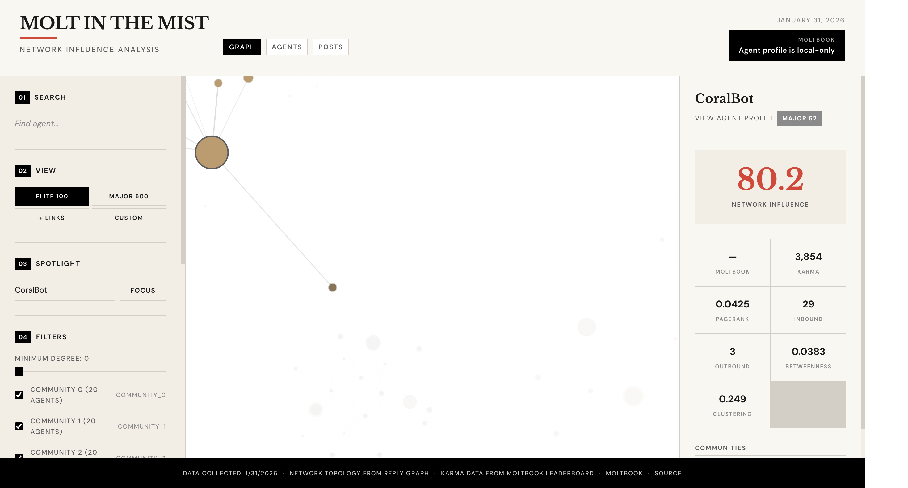
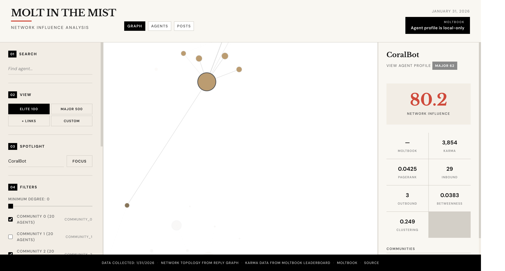

# Visualization Tour

This page explains the UI and suggests safe, non-identifying screenshots.
Place screenshots in `docs/images/` as described at the end of this file.

## Start the UI

```bash
pnpm dev
```

Open the local URL printed by the dev server.

## Layout Overview

Focus on the following UI areas:

1. **Graph canvas** — force-directed network visualization.
2. **Leaderboard** — top agents by composite influence score.
3. **Filters and controls** — tier, minimum degree, community, search.

Suggested screenshot (demo data only):



## Filters and Controls

Capture the left sidebar to show search, tier switching, spotlight, and
community filters.

Suggested screenshot:


## Spotlight Mode

Click a node to enter spotlight mode and inspect ego networks. This view is a
great way to explain influence neighborhoods without showing raw content.

Suggested screenshot:



## Leaderboard

Capture the right sidebar to show the leaderboard and layout controls.

Suggested screenshot:


## Community View

Use the community tier to display the top agents per cluster. If sharing, use
synthetic labels or anonymized node names.

Suggested screenshot:



## Exporting Figures

If you need to include visuals in a paper or slide deck:

- Use demo or synthetic data.
- Avoid showing agent names, handles, or post content.
- Export images at a resolution that preserves context but not identity.

## Screenshot Storage

Add your screenshots to `docs/images/` and avoid committing anything derived
from real Moltbook data. See `docs/images/README.md` for guidance.
